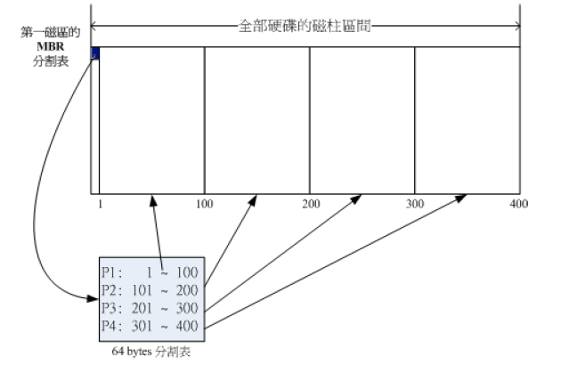
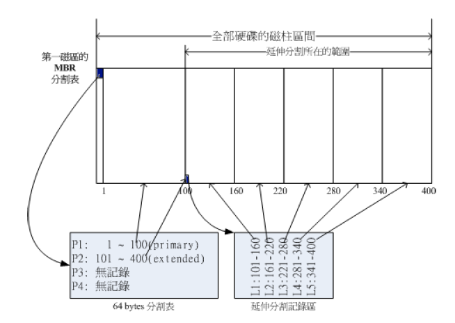

# Linux与硬件

linux中每一个硬件都被当成文件来看待。如硬盘为 /dev/sd[a-d]

## 磁盘分区
磁盘分区有 MBR 和 GPT 两种方法

### MBR分区法

磁盘第一个扇区(512bytes)存以下信息：
- 启动记录区(MBR): 安装开启管理程序 446bytes
- 分区表：记录分区状态 64bytes 最多记录4组，每组记录了该分区的开始和结束磁柱号码，如：


p1: /dev/sda1
p2: /dev/sda2
p3: /dev/sda3
p4: /dev/sda4

最多记录4个分区，这4个分区为主分区(P)或延伸分区(E),其中E最多为1个。

延伸分区E不能格式化，他的目的是使用额外扇区来记录分区信息，从而进行更多的分区。由延伸分区继续分出来的称为逻辑分区(L)，逻辑分区可以格式化.如：


### 挂载

所谓挂载，即将一个目录当成磁盘分区的进入点。也就是说进入这个目录就访问到该分区的磁盘数据。

举例来说，/dev/sda1是一个硬盘分区，我们将/dev/sda1挂载到根目录下，当访问根目录时，就会访问到sda1这个分区。根目录是最重要的目录，必须挂载。

使用lsblk命令可以查看挂载信息

## linux目录与文件

特殊目录
```
.  次目录
.. 上层目录
-  前一个工作目录
~  用户家目录
```
所有目录都存在 . 和 ..这两个目录，即使是根目录/（.和..都是他自己）

### 环境变量
echo $PATH
```
[root@localhost dev]# echo $PATH
/usr/local/bin:/usr/bin:/usr/local/sbin:/usr/sbin:/home/hd/.local/bin:/home/hd/bin
```
为什么在任何路径下都能执行 ls等命令呢，就是因为环境变量.系统会根据PATH去一次寻找ls这个命令，先搜索岛的同名指令优先执行.

### 文件种类
- 常规文件：第一个字符为 - 
  - 文本文件
  - 二进制文件
- 目录： 第一个字符为 d
- 链接文件：l
- 设备文件
  - 区块文件 b
  - 字符文件 c
- SOCKET
- FIFO

### 文件权限
Linux 下基本权限有9个，为owner/group/others三者的 r(读) w(写) x(可执行)权限，其对应数字如下：
```
r -- 4
w -- 2
x -- 1
每组身份的权限数字为其各个权限累加，如假设owner有rwx三种权限，其数字为 4+2+1=7

因此 chmod 777 test -- 改变test文件权限为 rwxrwx---
```