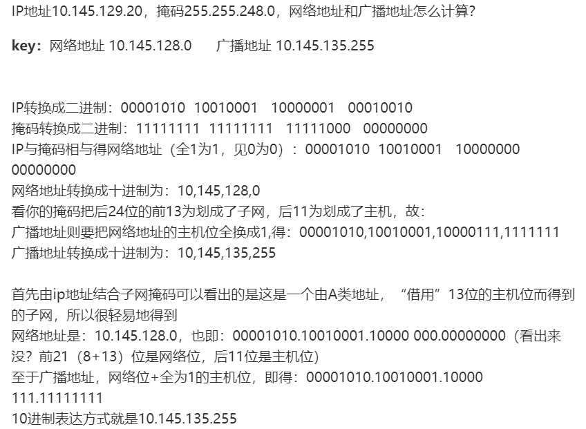

## 3.2 套接字地址结构

- 大多数套接字函数需要**一个指向套接字地址结构的指针**作为参数。

### 3.2.1 IPv4套接字结构

- IPv4套接字地址结构(sockaddr_in),定义在头文件<netinet/in.h>,它的POSIX定义如下:
```
struct in_addr {
    in_addr_t s_addr;           //32位IP地址    
};
struct sockaddr_in {
    uint_8 sin_len;             //结构的长度
    sa_family_t sin_family;     //AF_INET
    in_port_t sin_port;         //16位的端口号
    struct in_addr sin_addr;    //IP地址
    char sin_zero[8];           //未使用
};
```
- 套接字结构大小至少是16字节，包括sin_family, sin_addr, sin_port, sin_zero四个字段，前三个为POSIX规范。

数据类型 | 头文件  | 说明
---|---|---
sa_family_t | <sys/socket.h> | 套接字地址结构的地址族
socklen_t | <sys/socket.h | 套接字地址结构的长度，一般为uint32_t
in_addr_t | <netinet/in.h> | IPv4地址，uint32_t
in_port_t | <netinet/in.h> | 端口地址，uint16_t
- IPv4地址和端口号在套接字地址结构中总是以网络字节序来存储。
- 套接字地址结构仅在给定主机上使用：虽然某些字段(如IP地址和端口号)用于不同主机通信，但结构本身不在主机之间传递。

### 3.2.2 通用套接字地址结构
```
struct sockaddr {
    uint8_t sa_len;         
    sa_family_t sa_family;  
    char sa_data[14];
}
```
- 套接字函数使用指向某个通用套接字结构的指针作为参数之一。这也要求调用函数时**必须将指向特定套接字地址结构的指针强制转换，变成指向某个通用套接字地址结构的指针。**
```
int bind(int, struct sockaddr *, socklen_t);
struct sockaddr_in serv;        //IPv4地址结构
bind(sockfd, (struct sockaddr *) &serv, sizeof(serv));
```
### 3.2.3 IPv6套接字地址结构
- 在<netinet/in.h>头文件定义
```
struct in6_addr {
    uint8_t s6_addr[16];        //128位IPv6地址
};

#define SIN6_LEN

struct sockaddr_in6 {
    uint8_t sin6_len;
    sa_family_t sin6_family;
    in_port_t sin_port;
    uint32_t sin6_flowinfo;
    struct in6_addr sin6_addr;
    uint32_t sin6_scope_id;
};
```
- IPv4地址族为AF_INET, v6为AF_INET6。

- 从进程到内核传递套接字结构函数如bind,connect,sendto，**其参数一个是指向某个套接字结构的指针，另一个参数是该结构的大小，这样内核知道需要从进程复制多少数据进来。**
- 从内核到进程：有accept,recvfrom,getsockname,getpeername。**这四个函数两个参数是指向某个套接字地址结构的指针和指向表示该结构体大小的变量的指针**，后者告诉内核结构的大小，**这样内核在写入该结构不会越界，写入后又返回新的大小**。 
## 3.4 字节排序函数
- **小端字节序：低序字节在起始地址。**
- **大端字节序：高序字节在起始位置。**
- **网络字节序为大端字节序。**
- **字节序转换函数：**
```
#include <netinet/in.h>

// h为主机 n为网络 l为long s为short
uint16_t htons(uint16_t host16bitvalue);    
uint32_t htonl(uint32_t host16bitvalue);    //均返回网络字节序的值

uint16_t ntohs(uint16_t host16bitvalue);
uint32_t ntohl(uint32_t host16bitvalue);    //均返回主机字节序的值
```
## 3.5 字节操纵函数
```
// bzero 把目标字符串指定数目的字节置为0
void bzero(void *dest, size_t nbytes);
```
## 3.6 inet_aton、inet_addr、innet_ntoa函数
- 此三个函数能在**点分十进制字符串和网络字节序二进制值间转换IPv4地址**。
```
#include <arpa/inet.h>

//若字符串有效返回1,否则0
int inet_aton(const char *strptr, struct in_addr *addr);

/*若字符串有效返回32位二进制网络字节序IPv4地址，
否则返回INADDR_NONE(32为均为1的值)，这意味着
IPv4广播地址255.255.255.255不能由该函数处理*/
in_addr_t inet_addr(const char *strptr);

//返回一个指向点分十进制字符串的指针
char *inet_ntoa(struct in_addr inaddr);
```
## 3.7 innet_pton、innet_ntop函数
- 这两个函数对**IPv4和IPv6都适用**。p为表达，是ASCII字符串；n为数值，是存放于套接字地址结构中的二进制值。
```
#include <arpa/inet.h>

//成功返回1，不是有效表达式为0，出错返回-1
int inet_pton(int family, const char *strptr, void *addrptr);

//成功返回指向结果的指针，失败返回NULL
const char *inet_ntop(int family, const void *addrptr, char *strptr, size_t len);
```
- family参数为AF_INET或者AF_INET6，若放入不被支持的参数返回错误并将**errno置为EAFNOSUPPORT**。
- **inet_ntop函数的strptr参数不能是空指针，必须预先分配内存，调用成功后这个指针就是函数返回值。**

# 第四章 基本TCP套接字编程

## 4.1 概述


## 4.2 socket函数

- 为了执行网络I/O，一个进程第一步就是调用socket函数，指定期望的通信协议。（如TCP、UDP）
```
#include <sys/socket.h>

//成功返回非负描述符，失败返回-1
int socket(int family, int type, int protocol);
```
- 一个基本的TCP网络编程模型如下:


family | 说明
---|---
AF_INET | IPv4
AF_INET6 | IPv6
AF_LOCAL | UNIX域协议
AF_ROUTE | 路由套接字
AF_KEY | 密钥套接字


type | 说明
---|---
SOCK_STREAM | 字节流套接字
SOCK_DGRAM | 数据报套接字
SOCK_SEQPACKET | 有序分组套接字
SOCK_RAW | 原始套接字


protocol | 说明
---|---
IPPROTO_CP | TCP
IPPROTO_UDP | UDP
IPPROTO_SCTP | SCTP

- AF前缀表示地址族，PF前缀表示协议族

## 4.3 connect函数

- TCP使用connect函数建立TCP连接。
```
#include <sys/socket.h>
//成功返回0, 否则返回-1
int connect(int sockfd, const struct sockaddr *servaddr, socklen_t addrlen);

```
- 客户调用connect函数之前**不一定必须要调用bind函数**，因为如果需要的话，客户主机内核会确定源IP地址，并选择一个**临时端口**。
- TCP套接字调用connect函数建立三次握手过程，**仅在连接成功或者出错才返回**，出错情况：</br>
    1.TCP客户超时没有收到SYN响应，返回ETIMEDOUT错误。</br>
    2.对客户SYN的响应是**RST(复位)**,表明服务器主机在指定端口上没有进程等待连接，这是一种硬错误，**一收到RST则立马返回ECONNREFUSED错误**。</br>
    3.客户发出的SYN在某个中间路由器引发目的地不可达**ICMP错误，这是一种软错误**。
- **在每次connect失败后，都必须调用close关闭当前套接字描述符再重新调用socket。**

### 阻塞connect
通常阻塞的connect 函数会等待三次握手成功或失败后返回，0成功，-1失败。如果对方未响应，要隔6s，重发尝试，可能要等待75s的尝试并最终返回超时，才得知连接失败。
### 非阻塞connect
connect （函数本身返回-1）会立即返回EINPROGRESS或EWOULDBLOCK错误，表示连接操作正在进行中，但是仍未完成；同时TCP的三路握手操作继续进行；在这之后，我们可以调用select来检查这个链接是否建立成功：
- 若建立连接成功，select的结果中该描述符可写；
- 若失败，则套接字可写可读，此时可以使用getsockopt获取错误信息

一般来说非阻塞connect流程如下：

A. 如果connect 返回0，表示连接成功（服务器和客户端在同一台机器上时就有可能发生这种情况）；

B. 调用select 来等待连接建立成功完成；
     如果select 返回0，则表示建立连接超时。我们返回超时错误给用户，同时关闭连接，以防止三路握手操作继续进行下去。
     如果select 返回大于0的值，则需要检查套接口描述符是否可写，如果套接口描述符可写，则我们可以通过调用getsockopt来得到套接口上待处理的错误（SO_ERROR）。如果连接建立成功，这个错误值将是0；如果建立连接时遇到错误，则这个值是连接错误所对应的errno值（比如：ECONNREFUSED,ETIMEDOUT等）。


## 4.4 bind函数

- **bind 函数把一个本地协议地址赋予一个套接字。**
```
//成功返回0，失败返回-1
#include <sys/socket.h>
int bind(int socked, const struct sockaddr *myaddr, socklen_t addrlen);
```
- 进程可以把一个特定的IP地址捆绑到它的套接字上，**不过这个地址必须是属于这个主机的网络接口之一**。对于服务器，就限定只接受目的IP为这个地址的连接。如果服务器没有绑定IP地址，那么**内核会把客户发送的SYN的目的地址作为服务器的源IP地址**。

IP | 端口 | 结果
---|---|---
通配地址 | 0 | 内核选择IP地址和端口
通配地址 | 非0 | 内核选择IP，进程指定端口
本地IP | 0 | 进程指定IP地址，内核选择端口
本地IP | 非0 | 进程指定IP地址和端口
- 通配地址由INADDR_ANY指定，其值一般为0，它告知内核去选择IP地址。
- 若用内核选择临时端口号，则bind并不返回所选择的值。事实上，由于第二个参数有const修饰，无法返回所选之值，为了得到这个内合绑定的端口需要使用getsockname函数来返回协议地址。
- 常见返回错误为EADDRINUSE(地址已使用)。
```
#include <netinet/in.h>
/*对于IPv4地址可以这么指定，对于IPv6不行，
因为128位的v6地址是存放于一个结构中，而在
C语言中赋值语句右边无法表示常量结构。*/
struct sockaddr_in servaddr;
servaddr.sin_addr.s_addr = htonl(INADDR_ANY);
//对于IPv6地址
struct sockaddr_in6 serv;
serv.sin6_addr = in6addr_any;
//in6addr_any变量在in.h中声明为extern常量IN6ADDR_ANY_INIT。

```

## 4.5 listen函数

- listen函数仅有TCP服务器调用，用于以下两件事情：</br>
(1) 当socket函数创建一个套接字会假定为主动套接字(试图调用connect函数)。listen把一个未连接的套接字转变为被动套接字等待他人连接(即从CLOSED状态转变为LISTEN状态)。</br>
(2)该函数第二个参数规定了内核应为相应套接字排队的最大连接个数。
```

#include <sys/socket.h>
//成功返回0 否则-1
int listen(int sockfd, int backlog);
```
- 内核为一个给定的监听套接字维持两个队列：</br>
(1)**未完成连接队列**：已经有客户发出的SYN分节到达服务器，服务器正在等待完成三次握手过程。这些套接字处于SYN_RCVD(同步已接收)状态。</br>
(2)**已完成连接队列**：已完成三路握手的套接字(ESTABLISHED)。


- 客户SYN到达时，TCP在未完成连接队列创建一个新项，然后响应三次握手第二个分节。直到客户确认后(第三个分节到达)从未完成队列移到已完成连接队列队尾。
- 当进程调用accept时候，已完成队列将队头返回给进程，**若为空则进程投入睡眠**。
- 在三路握手正常完成下(无丢失分节，无重传)，未完成队列中每一项存活的时间就是一个RTT，RTT的值取决于特定的客户和服务器(通常中值为187ms)。
- 当一个SYN分节到达而未完成连接队列是满的则忽略该分节，也不发送RST。
- 在三路握手完成之后，服务器调用accept之前到达的数据应该由服务器TCP排队，最大数据量是相应已连接套接字的接收缓冲区大小。

## 4.6 accept函数

- **accept函数由TCP服务器调用，用于从已完成连接队列队头返回下一个已完成连接。**
```
#include <sys/socket.h>
//成功返回非负描述符，失败返回-1
int accept(int sockfd, struct sockaddr *cliaddr, socklen_t *addrlen);
```
- 参数cliaddr和addrlen用来返回已连接的客户的协议地址。addrlen所引用的是cliaddr所指的套接字地址结构的长度，返回时返回内核存放该套接字地址结构内的确切字节数。
- 第一个参数为监听套接字，成功后函数返回值称为已连接套接字。**一个服务器通常只创建一个监听套接字**，而为每个用户创建一个已连接套接字，当服务器完成对该客户服务时就关闭该已连接套接字。
- **若为客户协议地址不感兴趣，可以将cliaddr,addlen置为NULL。**
- **13号端口是日期服务端口**，需要管理员权限。
- 慢系统调用：即可能永远阻塞的系统调用，多数网络函数属于这一类，如accept。当阻塞于慢系统调用的一个进程捕获到某个信号且相应信号处理函数返回时，该系统调用可能返回一个EINTR错误，因此我们需要重启被中断的系统调用，但对于connect函数来说不能重启，当该函数返回一个EINTR错误时，我们就不能再调用它，否则会立即返回一个错误。当connect被一个捕获的信号中断而不重启时，我们必须调用select来等待连接完成。
```
//重启accept中断
while(1) {
    clilen = sizeof(cliaddr);
    if((connfd = accept(listenfd, (SA *) &cliaddr, &clilen)) < 0 ) {
        if(errno == EINTR)
            continue;
        else
            printf("accept error");
    }
}
```
## 4.7 fork和exec函数

- fork函数时unix中派生新进程的唯一方法。
```
#include <unistd.h>
//在子进程返回0 父进程中返回子进程ID 出错返回-1
pid_t fork(void);
```
- **fork函数调用一次，返回两次。他在调用进程(父进程)返回子进程ID，在子进程中返回一次返回0。**
- **任何子进程只有一次父进程，可以用getppid取得。而父进程可以有多个子进程，因此必须记录fork返回值才能跟踪某个子进程。**
- **fork后父进程打开的所有描述符与子进程分享**。
- fork两个经典用法:</br>
(1)创建自身副本，这是网络服务器经典用法。</br>
(2)一个进程执行另一个程序。子进程调用exec把自身替换为新的程序，如shell。exec通常从新程序main方法开始执行，且进程ID不变。调用exec的进程称为调用进程，待新执行的程序称为新程序。(注意不是新进程，因为并没有创建新进程)
```
#include <unistd.h>

//成功不返回 出错返回-1

int execl(const char *pathname, const char *arg0,...);

int execv(const char *pathname, char *const *argv[]);

int execle(const char *pathname, const char *arg,..., char *const envp[]);

int execve(const char *pathname, const char *argv[], char *const envp[]);

int execlp(const char *pathname, const char *arg0,...);

int execvp(const char *pathname, const char *argv[]);

```
- 这些函数只有在出错时才返回调用者，因为成功后会转到新程序的main函数。
- 只有execve是内核调用，其他都是调用execve的库函数。

## 4.8 并发服务器
- 当一个连接建立后，accept返回，服务器接着调用fork派生一个子进程通过父进程共享的已连接套接字connfd处理该请求，父进程则关闭已连接套接字然后继续使用监听套接字等待另一个连接。
- 在并发服务器中父进程调用close关闭已连接套接字为什么没有终止与客户的连接呢?</br>
由于每个文件或套接字都有一个引用计数，他是当前打开着的引用该文件或套接字描述符的个数。父进程accept后套接字计数为1，**fork后由于与子进程共享变成2，当父进程关闭已连接套接字描述符时，只是从2变为1，而当子进程关闭已连接套接字有才变为0，此时与客户断开连接。**

## 4.9 close函数

- close函数用于关闭套接字，**调用后该套接字描述符不能再由进程使用**，即不能read或wirte。
- 如果确实想在某个TCP连接上发送一个FIN，可以用shutdown函数。
- 如果父进程对已连接套接字不调用close,那么父进程最终会耗尽可用描述符，更严重的是，**没有一个客户连接会终止，因为子进程调用close后只是从2减为1，而没有变为0，这将妨碍TCP连接终止序列产生，导致连接不能关闭。**

```
#include <unistd.h>

//成功返回0 失败返回-1
int close(int sockfd);
```

## 4.10 getsockname和getpeername函数

- 这两个函数返回与套接字相关联的本地或外地协议地址。
```
#include <sys/socket.h>

//成功返回0 失败返回-1

int getsockname(int sockfd, struct sockaddr *localaddr, socklen_t *addrlen);

int getpeername(int sockfd, struct sockaddr *peeraddr, socklen_t *addrlen);
```
- 在一个**没有bind的TCP客户**，connect成功返回后，getsockname返回由内核赋予的该连接的**本机IP地址和本地端口号。**
- 在以端口0调用bind后，getsockname返回由内核赋予的端口号。
- 在一个**以通用IP地址调用bind的TCP服务器上，accept成功后**，getsockname就可以返回**由内核赋予的该连接的本地IP地址。**
- **当一个服务器是由调用过accept的某个进程通过调用exec执行程序时，只能通过getpeername。**

## 4.11 小结
- 大多数**TCP服务器是并发的**，他为每个客户fork一个子进程。
- 大多数**UDP服务器是迭代的。**


# 网络调试命令

## route命令

作用：查看 修改本机路由表

用法：
- route print: 打印路由表
- route add: 添加路由项
- route delete: 删除


